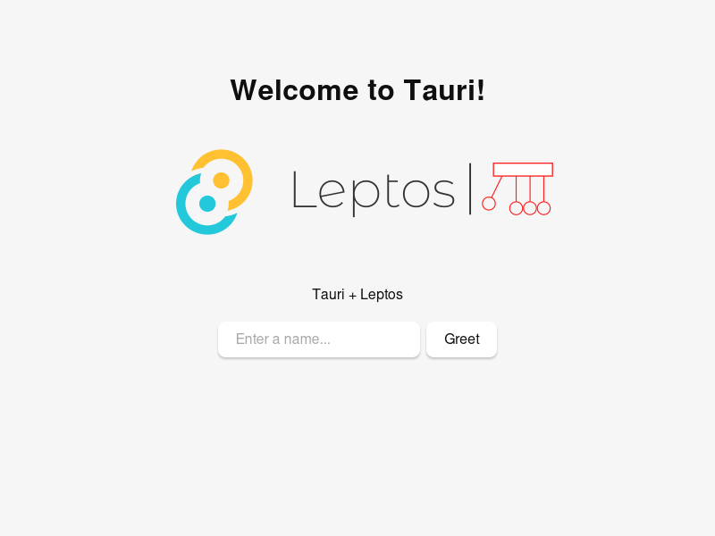

# Tauri + Leptos

This example should help get you started developing with Tauri and Leptos.

## Needed build tools:
You need to install [Trunk](https://trunkrs.dev/#install) add [Tauri](https://tauri.app/)

## Running Example
run `cargo tauri dev` add everything should work
